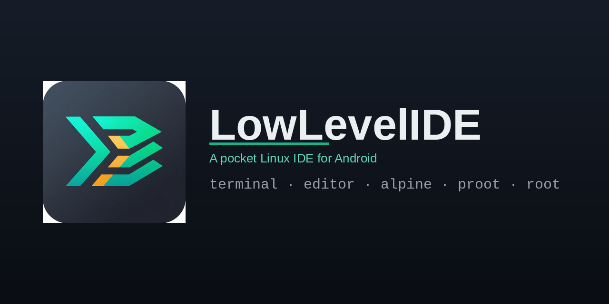

<div align="center">



# LowLevelIDE

**A pocket Linux IDE for Android — terminal, code editor, and a real toolchain. Root optional.**

[](https://github.com/REPLACE_OWNER/LowLevelIDE/actions/workflows/android.yml)
[](LICENSE)


</div>

---

LowLevelIDE combines a **Termux-grade terminal emulator**, a **CodeMirror editor**, and a
sandboxed **Alpine Linux** userland into a single Material 3 app. Compile C with `gcc`,
script in Python, build Rust and Go, manage source with `git` — all on-device. With root it
opens up to `/proc/kmsg`, `insmod`, `/sys/class/gpio` and raw sockets; without root it runs a
real Linux filesystem through a PRoot chroot.

## Highlights

- **Terminal** — full ANSI/VT100, multi-session tabs, a soft-keyboard extra-keys row
  (Esc, Tab, Ctrl, Alt, arrows), and a foreground service so sessions survive activity recreation.
- **Editor** — CodeMirror 5 with multi-tab editing, find/replace, jump-to-line, bracket matching,
  20+ language modes, **six selectable colour schemes**, soft word-wrap, and a build-and-run hook.
- **Toolchain** — Alpine `minirootfs` with `apk`, so `gcc`, `python3`, `git`, `rust`, `go`, and
  friends are one install away.
- **Three execution modes** — direct, PRoot chroot, or root `su`, chosen automatically and
  overridable in Settings.
- **File browser** — tree view, create/rename/delete, copy-path, **Storage Access Framework import**,
  and a **quick Git menu** (status, add, commit, log, pull, push) that drives the terminal.
- **Polished UX** — drawer navigation, light/dark/system themes, resizable editor/terminal split,
  a first-run onboarding wizard, and an in-app **crash reporter** with one-tap share.

## What's new in 2.1

| Area | Upgrade |
|------|---------|
| Build | Bundled `gradle-wrapper.jar` — clones build out of the box; Termux libs pinned to JitPack (zero-config). |
| Editor | Six colour schemes (Material Darker, Dracula, Monokai, Ayu Dark, Eclipse, IntelliJ) + soft word-wrap toggle. |
| Terminal | Six colour palettes (GitHub Dark, Solarized, Dracula, Gruvbox, Nord, Light) with full 16-colour ANSI tables. |
| Files | SAF importer to pull in files from anywhere on the device; in-browser Git action menu. |
| Reliability | Global crash handler that persists reports and shares them via `FileProvider`. |
| Branding | New adaptive launcher icon (with Android 13 themed-icon monochrome layer) and teal/emerald Material 3 palette. |
| CI | GitHub Actions builds the debug APK and runs lint on every push. |

## Architecture

```
MainActivity (DrawerLayout + toolbar + 3 panes)
├── EditorFragment       WebView hosting CodeMirror — multi-tab, find, themes, build/run
├── TerminalFragment     TerminalView + tab strip + ExtraKeysView + palette engine
├── FileBrowserFragment  RecyclerView tree, context menu, SAF import, Git menu
├── SettingsFragment     DataStore-backed prefs (theme, fonts, schemes, root/proot, crash logs)
└── AboutFragment

PtyService (foreground)
└── TerminalSessionManager
    └── TerminalSessionProvider
        ├── root mode    su -c <bootstrap>/bin/bash
        ├── proot mode   proot -r <bootstrap> -0 -b /proc -b /dev …
        └── direct mode  /system/bin/sh with augmented PATH/LD_LIBRARY_PATH

OnboardingActivity (first launch only)
├── BootstrapInstaller   extracts Alpine rootfs (Apache Commons Compress)
├── BootstrapDownloader  auto-fetches alpine-minirootfs from the Alpine CDN
├── PRootInstaller       auto-fetches a static proot binary
└── CodeMirrorInstaller  auto-fetches CodeMirror v5 (lib + addons + modes + themes)

util/CrashHandler        global uncaught-exception capture → <filesDir>/crash/*.log
```

## Build

```bash
git clone https://github.com/REPLACE_OWNER/LowLevelIDE.git
cd LowLevelIDE
cp local.properties.example local.properties   # then point sdk.dir at your Android SDK
./gradlew :app:assembleDebug
adb install app/build/outputs/apk/debug/app-universal-debug.apk
```

The Gradle wrapper JAR is committed, so the build works without Android Studio. First launch
runs a 3-page onboarding wizard that downloads ~5 MB of dependencies (Alpine + PRoot +
CodeMirror); subsequent launches skip it. To ship fully offline, drop the same files into
`app/src/main/assets/bootstrap/` and `app/src/main/assets/editor/` — the installers check
there before hitting the network.

## Capability matrix

| Feature                          | Direct | PRoot  | Root   |
|----------------------------------|:------:|:------:|:------:|
| GCC / Python / Rust / Go         | yes    | yes    | yes    |
| `apk add` (network required)     | yes    | yes    | yes    |
| chroot to /                      | no     | yes    | yes    |
| Read own `/proc/<pid>/…`         | yes    | yes    | yes    |
| Read `/proc/kmsg`                | no     | no     | yes    |
| `insmod` / `rmmod`               | no     | no     | yes    |
| `/sys/class/gpio` write          | no     | no     | yes    |
| Raw sockets                      | no     | no     | yes    |
| Symlinks survive reboot          | partial| partial| yes    |

## Customization

- **Editor colour scheme & word-wrap** — Settings → Appearance.
- **Terminal palette & font** — Settings → Terminal.
- **Execution mode** — Settings → Terminal toggles for root preference and PRoot.
- **Crash reports** — Settings → Developer → view and share the latest report.

## Termux library resolution

The terminal stack resolves from **JitPack** (declared in `settings.gradle.kts`), so no extra
setup is needed:

```kotlin
implementation("com.github.termux.termux-app:terminal-view:v0.118.0")
implementation("com.github.termux.termux-app:terminal-emulator:v0.118.0")
```

Prefer to vendor the source instead? Add the upstream repo as a submodule:

```bash
git submodule add https://github.com/termux/termux-app vendor/termux-app
```

then include `:terminal-view` / `:terminal-emulator` in `settings.gradle.kts` and swap the
dependency coordinates for `project(":terminal-view")` / `project(":terminal-emulator")`.

## Roadmap

- LSP integration for completion beyond mode-based highlighting.
- Live debugger UI on top of `gdbserver`.
- Native Git GUI (CLI already works).
- Editor and terminal palette previews in Settings.

## Contributing

Contributions are welcome. Please read [CONTRIBUTING.md](CONTRIBUTING.md) and the
[Code of Conduct](CODE_OF_CONDUCT.md) first, and report security issues per
[SECURITY.md](SECURITY.md).

## License & redistribution

| Component               | License      |
|-------------------------|--------------|
| LowLevelIDE             | GPL-3.0      |
| Termux terminal libs    | GPL-3.0      |
| CodeMirror 5            | MIT          |
| Apache Commons Compress | Apache-2.0   |
| OkHttp                  | Apache-2.0   |
| AndroidX / Material 3   | Apache-2.0   |
| Alpine Linux rootfs     | various FOSS |
| PRoot                   | GPL-2.0      |

Because the Termux libraries are GPLv3, the distributed APK is licensed under **GPL-3.0**.
See [LICENSE](LICENSE). To ship under another licence, replace the Termux dependencies with an
alternative terminal stack.
